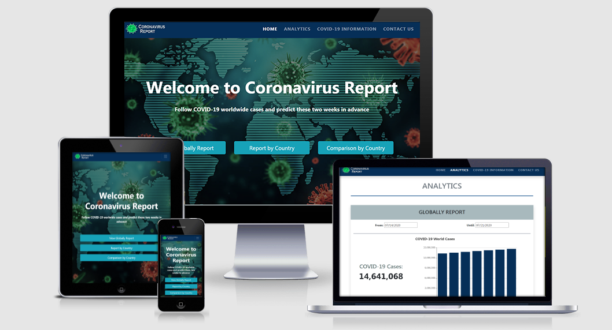

# Coronavirus Report
## Code Institute: Milestone Project 2

Coronavirus Report is a website that aims to inform people about COVID-19 globally cases, displaying 
the information in a clear and simple way. In addition to follow the coronavirus worldwide cases, you 
can also review the information for each country and using historical data, Coronavirus Report is able 
to predict future cases of COVID-19 with 2 weeks in advance, due to the use of machine learning technology.

The idea for this project was born from the current situation the world is going through because of this virus, 
which still has no vaccine and has meant a complete change in the way we live our daily lives.

<a href= "https://cotebarrientos.github.io/2nd-milestone-project-coronavirus-report/" target= "_blank">Click here to view the project live</a>

## UX

### Main aims

- To Provide a platform for users to review information about this new coronavirus, and check the situation 
both globally and in their respective countries.
- To make the website interactive through the use of JavaScript, using different libraries and APIs available 
to create a great user experience.
- To make it easy for users to make their way through each feature on the website, by having a clear menu bar. 
- To create a design that would be fully responsive on all devices and screen sizes.

### Ideal user

#### The ideal user for this website is:

- English speaking, due to the website language.
- Who ideally has a good internet connection.

#### Visitors to this website are searching for:

- Information related to the COVID-19, due to the fact that it is a new disease that is affecting the whole world, and 
is at the moment of greatest concern worldwide. 

#### This project is the best way to help them achieve these things because:

- This is a great platform to display the information required by users, because it allows you to interact with the data 
available about this new coronavirus.
- There are similar platforms, but these do not allow users to interact much with the information, instead Coronavirus 
Report allows you to choose the range of dates to consult 
  the data of your interest, and then these are presented in different charts.
- Coronavirus Report does something that other platforms do not have, and the reason is that it is able to predict future 
cases in any country through the use of machine learning technology.
- This website also has a small section with summary information about the coronavirus.
- This platform is interested in knowing what its users think, therefore it has a contact page.

### User Stories

- As a user, I want a website where I can follow the COVID-19 worldwide cases in a clear
  and a simple way.
- As a user, I want a website where I can check and follow information about coronavirus cases
  per country.
- As a user, I want a website where I can review information about COVID-19 cases of my country and
  I would like to know about future cases as well.
- As a user, I would like to make a comparison between 2 countries to contrast how they are dealing with the threat of the coronavirus.
- As a user, I want a website that shows a summary about the new coronavirus.
- As a user, I want a website that has a contact page, where I can express my questions or suggestions.

### Design Process

1. **Strategy Plane:** My goal in creating this project was to provide a platform for users to review information 
about the COVID-19 and check both the worldwide and any country situation, in a clear and simple way.

2. **Scope:** For users, I wanted to offer relevant information for them, since this new coronavirus has burst into our lives in a 
very sudden way, and it is also a very current topic, therefore, it was necessary to show the situation that is lived worldwide and
 at the same time provide information from each country. To do this, I created a welcome page with quick access to the desired 
 information, a page with different analyses displayed in order by date, so users can check if the curve is flattened or not.

3. **Structure:** On the analylics page, I wanted to show them a series of charts displayed in 3 sections, the first one for global 
reports, showing information in 3 bar charts for covid cases, covid deaths and covid recoveries. The second for country reports, 
like the first one, shows 3 charts with the same relevant data as before, only with the difference that it will show a projection 
of cases. The third shows the same data as the first one, only with the difference that you can contrast the information between two countries.

4. **Skeleton:**
  - Home page wireframe.
    - <a href="https://github.com/cotebarrientos/2nd-milestone-project-coronavirus-report/blob/master/assets/wireframes/home_page_desktop.png" target="_blank">Desktop</a>
    - <a href="https://github.com/cotebarrientos/2nd-milestone-project-coronavirus-report/blob/master/assets/wireframes/home_page_mobile.png" target="_blank">Mobile phone</a>
  - Analytics page page wireframe.
    - <a href="https://github.com/cotebarrientos/2nd-milestone-project-coronavirus-report/blob/master/assets/wireframes/analytics_desktop.png" target="_blank">Desktop</a>
    - <a href="https://github.com/cotebarrientos/2nd-milestone-project-coronavirus-report/blob/master/assets/wireframes/analytics_page_mobile.png" target="_blank">Mobile phone</a>
  - COVID-19 Information page wireframe.
    - <a href="https://github.com/cotebarrientos/2nd-milestone-project-coronavirus-report/blob/master/assets/wireframes/covidinfopagedesktop.png" target="_blank">Desktop</a>
    - <a href="https://github.com/cotebarrientos/2nd-milestone-project-coronavirus-report/blob/master/assets/wireframes/covid19_information_page_mobile.png" target="_blank">Mobile phone</a>
  - Contact Us page wireframe.
    - <a href="https://github.com/cotebarrientos/2nd-milestone-project-coronavirus-report/blob/master/assets/wireframes/contact_us_page_desktop.png" target="_blank">Desktop</a>
    - <a href="https://github.com/cotebarrientos/2nd-milestone-project-coronavirus-report/blob/master/assets/wireframes/contact_us_page_mobile_.png" target="_blank">Mobile phone</a>

5. **Surface:** In general, blue tones were chosen for the navigation bar and footer, as it is a pleasant colour to look at. The font used
 for the website was the default Bootstrap, and a simple and practical design was chosen, making use of a hero image on the Home page and 
 2 cover images for the COVID-19 Information and Contact Us pages. For the Analytics page, a white background color (#FFF) was used, to 
 better display the graphics for the users to view. In the COVID-19 Information page, I opted to use bright colors and images, in order to 
 attract the user's attention and to keep the information provided in his/her mind. For the Contact Us page, a white background was used, 
 trying to be as minimalist as possible.

## Features 

### Existing Features

The project consists of 4 pages, which can be reached through the **navigation bar** with conventional placing of logo (top left). Each page has
 a **footer** with copyright information. The website is totally responsive. 

#### Home Page

It is responsible for welcoming future users. It is divided into 3 sections:

- **Welcome section:** This section has a hero image at the top, with a brief description of the website and 3 buttons that when pressed will
  take you directly to different sections on the Analytics Page.

- **About Us section:** In this section you will find a more detailed description about Coronavirus Report, and in addition the website description 
is accompanied by an image of the virus.

- **Information section:** This section contains some information about COVID-19 and a button, which when pressed, it will direct you to the COVID-19 
Information page.

#### Analytics Page

It is responsible to display the COVID-19 information to the users. This page contains 3 sections.

- **Globally Report:** This section will display information about the global reports of this new virus, where through some datepicker, the user can select 
a date range of his/her interest, and once that is done, the information will be shown in 3 charts.
  - *Chart 1:* Displays the total worldwide cases.
  - *Chart 2:* Displays the total worldwide deaths.
  - *Chart 3:* Displays the total worldwide recovered. 

- **Report by Country:** This section will display information about the country reports on this new virus, where the user must first select a country of his/her
 interest, then the user must select a date range using the datepicker, and once that is done, the information will be displayed in 3 charts. If the user wants, 
 he can also select the projected cases checkbox, which will be activated showing 2 weeks of forecast in the selected country.

  - *Chart 1:* Displays the total country cases. If the user press the projected checkbox, it will display 2 weeks of projection.
  - *Chart 2:* Displays the total country deaths.
  - *Chart 3:* Displays the total country recovered.

- **Comparison by Country:** This section will display information about the country reports for 2 countries, where the user must first select 2 country of his/her 
interest, then the user must select a date range using the datepicker, and once that is done, the information will be displayed in 3 charts.

  - *Chart 1:* Displays the total countries cases.
  - *Chart 2:* Displays the total countries deaths.
  - *Chart 3:* Displays the total countries recovered.

#### COVID-19 Information Page

This page contains useful information about this new coronavirus,and also has a cover image, page title and a brief description of the page. It is divided into 3 sections,
 and every section has an image.

- **What you need to know:** This section shows a resume with relevant information of the COVID-19.

- **About Coronaviruses:** This section shows summary information on what coronaviruses are.

- **Protect yourself and other from coronavirus:** This section contains some advice on how to avoid getting coronavirus disease and protect others from getting it.

#### Contact Us Page

This page contains a cover image, page title and a small message. It has a **contact form** which request user name, email and a box to leave a message. Once the user finishes 
writing his/her message, the contact form has a Send Button, which when pressed, will display a mini modal window with a thank you message.

### Features Left to Implement

In the future I would like to implement in **Comparison by Country section** the possibility to *compare more than 2 countries at the same time*, it was something
 contemplated at the beginning of this project, but due to the lack of time, it could not be implemented.

## Technologies Used

- HTML 5
  - The project uses **HTML5** to define the structure of this website.

- CSS 3
  - The project uses **CSS3** to add styling to the website.

- JavaScript
  - The project uses  **Javascript** to implement the different APIs and JS library to create a completely interactive website.

- <a href= "https://getbootstrap.com/" target= "_blank">Bootstrap 4.5.0</a>
  - The project uses **Bootstrap** version 4.5.0 , to build responsive website.

- <a href= "https://jquery.com/" target= "_blank">jQuery 3.5.1</a>
   - The project uses **jQuery** version 3.5.1 to implement interactivity to the website.

- <a href= "https://jqueryui.com/" target= "_blank">jQuery UI 1.12.1</a>
  - The project uses **jQuery UI** version 1.12.1 to implement datepicker to the website.  
  
- <a href= "https://echarts.apache.org/en/index.html" target= "_blank">Echarts Library</a>
  - The project uses **Echart Library** to implement the different charts used to display the information about COVID-19.

- <a href= "https://covid19-api.org/" target= "_blank">COVID-19 API</a>
  - The project uses **COVID-19 API** to request information about timeline and projected cases. This API uses *machine learning technology*. 

- <a href= "http://api.coronatracker.com" target= "_blank">Corona Tracker API</a>
  - The project uses **Corona Tracker API** to request information about every country.

- <a href= "https://github.com/mrmarkfrench/country-select-js" target= "_blank">Country Select JS Library</a>
  - The project uses **Country Select JS Library** to implement the country Dropdown list.

- <a href= "https://www.emailjs.com/" target= "_blank">Email JS</a>
  - The project uses **Email JS** to implement a functional contact us page.

- <a href="https://fontawesome.com/" target="_blank">FontAwesome</a>
  - The project uses free **FontAwesome** icons.

- <a href="https://www.postman.com/" target="_blank">Postman</a>
  - The project uses **Postman**  to test the APIs used to request information about the COVID-19.

- <a href= "https://git-scm.com/" target= "_blank">Git</a>
  -  The project uses **Git** to control the different versions and history of the code.

- <a href= "https://github.com/" target= "_blank">GitHub</a>
  - The project uses **GitHub** to host the source code, and deploy the website using GitHub pages.

- <a href="https://pencil.evolus.vn/" target="_blank">Pencil</a>
  - The project uses **Pencil** version 3.1.0 to create the wireframes.

- <a href= "https://affinity.serif.com/en-gb/designer/" target= "_blank">Affinity Designer</a>
  - The project uses **Affinity Designer** version 1.6.5.123, to make the website logo.

- <a href= "https://www.adobe.com/ie/" target= "_blank">Adobe Photoshop</a>
  - The project uses **Adobe Photoshop CS6** portable version 13.0.0, to improve the images used in the website.

## Testing

Please view the complete testing process in this separate document <a href="https://github.com/cotebarrientos/2nd-milestone-project-coronavirus-report/blob/master/assets/documentation/TESTING.md" target="_blank">here</a>.

## Deployment

This project was developed using **Gitpod** and **Visual Studio Code**. 

### Deploying to GitHub Pages

To deploy this page to GitHub Pages from its <a href= "https://github.com/cotebarrientos/2nd-milestone-project-coronavirus-report" target="_blank">GitHub repository</a>, 
the following steps were taken:

1. Log into **GitHub**.
2. Open the **'Settings'** section of the project repository in GitHub.
3. Scroll down to the **GitHub Pages** section.
4. Under Source click the drop-down menu labelled **None** and select **Master Branch** or **Marter Branch/docs folder**.
5. On selecting **Master Branch** the page is automatically refreshed, the website is now deployed.
6. On selecting **Master Branch/docs folder** , first you have to move your files into a docs folder, and then, the page is refreshed and the website is deployed.
7. Scroll back down to the **GitHub Pages** section to retrieve the link to the deployed website.

### Cloning the project

To clone this project from GitHub:

1. Follow this link to the <a href="https://github.com/cotebarrientos/2nd-milestone-project-coronavirus-report" target="_blank" >Project GitHub repository.</a>
2. Scroll to the top of this repository and click on the "clone or download button".
3. Decide whether you want to clone the project using HTTPS or an SSH key and do the following:
    - HTTPS: click on the checklist icon to the right of the URL.
    - SSH key: first click on 'Use SSH' then click on the same icon as above.
4. Open the 'Terminal'.
5. Choose the location for the cloned directory.
6. Type `git clone`, and then paste the clone URL.

>`git clone https://github.com/USERNAME/REPOSITORY`
 
 7. Press 'Enter' to create your local clone.

 ## Credits

 ### Content

 - The text for the COVID-19 Information page  was copied and modified from <a href="https://coronavirus.jhu.edu/" target="_blank">Johns Hopkins Coronavirus Resource Center</a>.

### Media

- The images used in this site were obtained from Google images and were improved using Adobe Photoshop.

### Acknowledgements

- I received inspiration for this project from the following websites:
  - <a href="https://coronavirus.jhu.edu/" target="_blank">Johns Hopkins Coronavirus Resource Center</a>
  - <a href="https://covid19.who.int/?gclid=CjwKCAjw57b3BRBlEiwA1ImytjUNXwWt4AN-gPPibZ89US3Jas3k_mCdBrhb_v1TpGbXjfobpcHyeRoCnFcQAvD_BwE" target="_blank">WHO Coronavirus Disease (COVID-19) Dashboard</a>
  - <a href="https://www.worldometers.info/coronavirus/" target="_blank">WorldMeter</a>
  - <a href="https://coronavirus.app/map" target="_blank">Coronavirus App</a>

- These websites were really useful to troubleshooting the issues I faced:
  - <a href="https://stackoverflow.com/" target="_blank">Stackoverflow</a>
  - <a href="https://getbootstrap.com/docs/4.5/getting-started/introduction/" target="_blank">Bootstrap Documentation</a>
  - <a href="https://www.w3schools.com/" target="_blank">w3schools</a>
  - <a href="https://jquery.com/" target="_blank">jQuery Documentation</a>
  - <a href="https://jqueryui.com/" target="_blank">jQuery UI</a>
  - <a href="https://echarts.apache.org/en/option.html#title" target="_blank">Echart Documentation</a>

- Thank you to the following people who helped with support, inspiration and guidance at different stages in the project:
  - The guidance and support of my mentor Brian Macharia.
  - My family and friends.
  - My fellow workers.

>**Disclaimer**
  >>The content of this Website is for educational purposes only.
>
